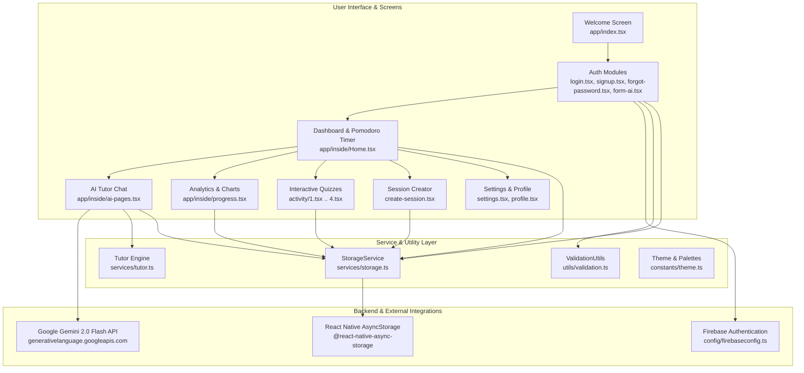
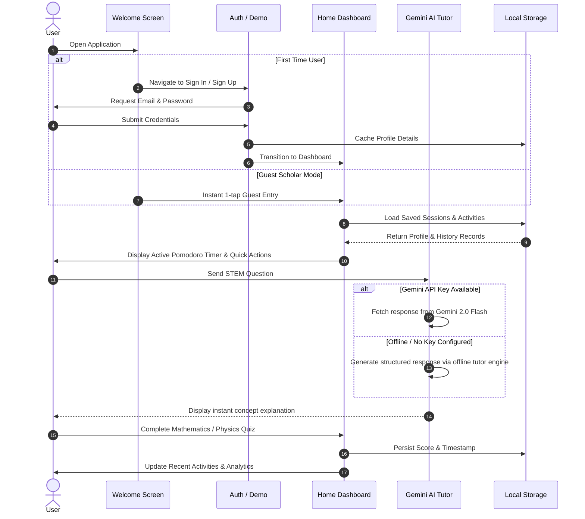

# StudyMate AI 🎓📱

[](https://expo.dev)
[](https://reactnative.dev)
[](https://www.typescriptlang.org)
[](https://firebase.google.com)
[](https://ai.google.dev/)
[](https://jestjs.io)
[](https://opensource.org/licenses/MIT)

**StudyMate** is an intelligent mobile study companion and personal academic assistant built with **React Native**, **Expo SDK 52**, and **TypeScript**. Powered by **Google Gemini 2.0 Flash AI** and backed by **Firebase Authentication** and persistent offline storage, StudyMate helps students master STEM subjects (Mathematics, Physics, Chemistry, Biology) through interactive quizzes, smart focus timers, structured session planning, and comprehensive performance analytics.

---

## Table of Contents

- [Overview](#overview)
- [Key Features](#key-features)
- [Screenshots & Assets](#screenshots--assets)
- [Architecture](#architecture)
- [Application Workflow](#application-workflow)
- [Tech Stack](#tech-stack)
- [Project Structure](#project-structure)
- [Prerequisites](#prerequisites)
- [Installation & Setup](#installation--setup)
- [Environment Variables](#environment-variables)
- [Running the Application](#running-the-application)
- [Services & API Reference](#services--api-reference)
- [Database & Storage](#database--storage)
- [Authentication & Demo Mode](#authentication--demo-mode)
- [Testing & Quality Assurance](#testing--quality-assurance)
- [Troubleshooting](#troubleshooting)
- [Known Limitations & Future Roadmap](#known-limitations--future-roadmap)
- [License](#license)
- [Author & Acknowledgements](#author--acknowledgements)

---

## Overview

Modern academic learning requires active recall, spaced repetition, and real-time concept clarification. **StudyMate** combines:
1. **Interactive STEM Learning**: Subject-specific quizzes, equation cheatsheets, and guided theory modules.
2. **Generative AI Tutoring**: Instant explanations and problem-solving breakdowns powered by Google Gemini 2.0 Flash (with a built-in offline educational rule engine when offline).
3. **Productivity & Habit Formation**: Built-in Pomodoro focus timer with automated rest intervals.
4. **Data-Driven Self-Reflection**: Visual study analytics, weekly time allocation charts, and mastery meters.

---

## Key Features

### 🤖 Generative AI Study Tutor
- Real-time conversational tutoring powered by **Google Gemini 2.0 Flash**.
- In-app custom Gemini API key configuration modal with persistent storage.
- Intelligent **offline tutor fallback engine** that provides structured problem-solving frameworks, Newton's motion laws, stoichiometry balancing rules, calculus derivative steps, and study methodology advice without an internet connection.

### ⏱️ Pomodoro Focus Timer
- 25-minute focused study sprint / 5-minute restorative break cycle.
- Smooth spring-animated timer indicators using `react-native-reanimated`.
- Session completion notifications and one-tap mode switching.

### 📝 Interactive STEM Quizzes & Drills
- **Activity 1 — Mathematics Mastery Quiz**: Arithmetic progressions, algebra, geometric series, and timed evaluations.
- **Activity 2 — Physics Classical Mechanics**: Chapter study guide with formulas, interactive comprehension checkboxes, and concept clarification shortcuts.
- **Activity 3 — Chemistry Stoichiometry**: Molar mass calculations, gas law equations, balancing reaction problems.
- **Activity 4 — Biology & Genetics**: Mitosis/meiosis phase reviews, cellular structures, organelles, and DNA transcription.
- Real-time score tallying, instant answer review, and automatic recording to personal study history.

### 📅 Session Planning & Scheduler
- Create study sessions with target subject, duration (hours and minutes), and study mode (Individual vs. Group).
- Add rich notes and attach study materials and PDFs using `expo-document-picker`.
- Quick-action deletion and persistent dashboard synchronization.

### 📊 Deep Performance Analytics
- Multi-timeframe trend visualization (Week, Month, Year) powered by `react-native-chart-kit`.
- Core subject distribution bar charts (Math, Physics, Chemistry, Biology).
- Key Performance Indicators: Total focused study time, current study streaks, and subject mastery percentages.

### 🌓 User Profiles & Theming
- Complete light and dark theme support adhering to system preferences.
- Profile customization: Full name, university, major, bio, and custom avatar upload via `expo-image-picker`.
- In-app settings for push notifications, audio feedback, offline synchronization, and localization preferences.

---

## Screenshots & Assets

StudyMate includes optimized visual assets located in the [`assets/`](file:///root/studymate/StudyMate/assets) directory:

| Asset | Description | Path |
|---|---|---|
| **App Icon** | Primary application launcher icon | `assets/images/icon.png` |
| **Splash Icon** | Native launch screen splash branding | `assets/images/splash-icon.png` |
| **Mathematics Banner** | Linear algebra and calculus cover | `assets/images/math1.jpg` |
| **Physics Banner** | Dynamics and mechanics illustration | `assets/images/physics.jpg` |
| **Chemistry Banner** | Laboratory and chemical bonding illustration | `assets/images/maxresdefault.jpg` |
| **Biology Banner** | Cellular biology and genetics cover | `assets/images/biology.jpg` |

---

## Architecture

StudyMate is architected as a modular, client-side application leveraging Expo Router's file-based navigation, separated service layers for persistence and AI communication, and decoupled UI design components.



---

## Application Workflow



---

## Tech Stack

| Category | Technology | Purpose |
|---|---|---|
| **Framework** | [Expo SDK 52](https://expo.dev) | Cross-platform build tools, runtime, and native plugins |
| **Mobile Core** | [React Native 0.76.7](https://reactnative.dev) | Core native runtime with New Architecture enabled |
| **Language** | [TypeScript 5.3](https://www.typescriptlang.org) | Strict type checking, robust interfaces, and autocomplete |
| **Routing** | [Expo Router v4](https://docs.expo.dev/router/introduction) | Type-safe, filesystem-based routing |
| **Authentication** | [Firebase Auth v11.4](https://firebase.google.com/docs/auth) | User signup, sign-in, and password recovery |
| **AI Engine** | [Google Gemini 2.0 Flash](https://ai.google.dev/) | Multimodal reasoning, STEM problem solving, concept explanations |
| **Local Storage** | [AsyncStorage 1.23.1](https://react-native-async-storage.github.io/async-storage/) | Persistent profiles, sessions, quiz history, settings, and keys |
| **Data Visualization** | [react-native-chart-kit](https://github.com/indiespirit/react-native-chart-kit) | Smooth bezier line charts and subject time distribution bars |
| **Animation** | [React Native Reanimated 3.16](https://docs.swmansion.com/react-native-reanimated/) | High-performance spring animations for focus timers |
| **Device Integrations** | Expo ImagePicker, DocumentPicker, DateTimePicker | Document attachment, avatar photo upload, date scheduling |
| **Testing** | [Jest](https://jestjs.io/) & [jest-expo](https://docs.expo.dev/develop/unit-testing/) | Automated unit tests and native module mocking |

---

## Project Structure

```text
StudyMate/
├── .env.example                     # Environment variables template with placeholders
├── .gitignore                       # Git ignore rules for node_modules, keys, builds
├── README.md                        # Project documentation
├── app.json                         # Expo configuration, permissions, icons, and plugins
├── package.json                     # Project scripts and dependency declarations
├── tsconfig.json                    # TypeScript compiler configuration
├── jest.setup.js                    # Jest setup and AsyncStorage mock configuration
│
├── __tests__/                       # Automated test suites
│   ├── storage.test.ts              # Unit tests for persistent StorageService
│   ├── theme.test.ts                # Unit tests for design tokens & color schemes
│   ├── tutor.test.ts                # Unit tests for offline AI tutor rule engine
│   └── validation.test.ts           # Unit tests for auth validation, time & quiz scoring
│
├── app/                             # Expo Router file-based screens
│   ├── _layout.tsx                  # Root layout, theme status bar, and stack navigation
│   ├── index.tsx                    # Landing / welcome screen with guest mode
│   ├── settings.tsx                 # App preferences (notifications, sounds, language)
│   ├── Auth/                        # Authentication flows
│   │   ├── login.tsx                # Email/password login with demo fallback
│   │   ├── signup.tsx               # User registration and validation
│   │   ├── forgot-password.tsx      # Password reset flow
│   │   └── form-ai.tsx              # Onboarding study preferences & academic profile
│   └── inside/                      # Main authenticated application stack
│       ├── Home.tsx                 # Central dashboard with Pomodoro timer & subjects
│       ├── ai-pages.tsx             # Interactive AI tutor chat with API key manager
│       ├── create-session.tsx       # Study session planner with file attachments
│       ├── profile.tsx              # Student profile management and avatar editing
│       ├── progress.tsx             # Performance metrics, charts, and study history
│       ├── recent-activities.tsx    # Filterable quiz history and completion records
│       ├── activity/                # Subject-specific interactive learning modules
│       │   ├── 1.tsx                # Mathematics Quiz
│       │   ├── 2.tsx                # Physics Dynamics Chapter & Equation Guide
│       │   ├── 3.tsx                # Chemistry Stoichiometry Quiz
│       │   └── 4.tsx                # Biology Cell Structure & Genetics Quiz
│       └── progress/                # Dedicated course syllabus & mastery screens
│           ├── Mathematics.tsx
│           ├── Physics.tsx
│           ├── Chemistry.tsx
│           └── Biology.tsx
│
├── assets/                          # Static assets and course graphics
│   ├── fonts/                       # Custom typography (SpaceMono)
│   └── images/                      # App icons, splash screens, and subject covers
│
├── components/                      # Shared reusable UI components
│   ├── AppHeader.tsx                # Standardized header with back navigation & actions
│   ├── BottomNav.tsx                # Universal floating navigation bar
│   └── SubjectProgressView.tsx      # Reusable course progress dashboard template
│
├── config/                          # Configuration modules
│   └── firebaseconfig.ts            # Firebase app initialization and demo state detection
│
├── constants/                       # Style tokens and theming
│   └── theme.ts                     # Light and dark color palettes, typography, spacing
│
├── services/                        # Business logic and external service integrations
│   ├── storage.ts                   # Strongly-typed AsyncStorage persistence API
│   └── tutor.ts                     # Offline educational rule engine and fallback responses
│
└── utils/                           # Helper functions
    └── validation.ts                # Email/password validation, duration and score helpers
```

---

## Prerequisites

Before running StudyMate, ensure you have the following installed on your development machine:

- **Node.js**: `v18.x` or `v20.x` (LTS recommended)
- **npm** (`v9+`) or **yarn** (`v1.22+`)
- **Git** (`v2.30+`)
- **Expo Go App** (available on iOS App Store & Google Play Store) OR Xcode / Android Studio for emulator testing.

---

## Installation & Setup

1. **Clone the repository**:
   ```bash
   git clone https://github.com/H4R5787/StudyMate.git
   cd StudyMate
   ```

2. **Install project dependencies**:
   ```bash
   npm install
   ```

3. **Configure environment variables**:
   ```bash
   cp .env.example .env
   ```
   Edit `.env` with your preferred credentials (see [Environment Variables](#environment-variables)).

---

## Environment Variables

StudyMate uses Expo's public environment variable convention (`EXPO_PUBLIC_*`). These variables are embedded into client bundles at build time.

| Variable | Required | Description | Example Placeholder |
|---|---|---|---|
| `EXPO_PUBLIC_FIREBASE_API_KEY` | Optional | Firebase Web API Key | `YOUR_FIREBASE_API_KEY` |
| `EXPO_PUBLIC_FIREBASE_AUTH_DOMAIN` | Optional | Firebase Auth Domain | `YOUR_PROJECT_ID.firebaseapp.com` |
| `EXPO_PUBLIC_FIREBASE_PROJECT_ID` | Optional | Firebase Project ID | `YOUR_PROJECT_ID` |
| `EXPO_PUBLIC_FIREBASE_STORAGE_BUCKET` | Optional | Firebase Cloud Storage Bucket | `YOUR_PROJECT_ID.appspot.com` |
| `EXPO_PUBLIC_FIREBASE_MESSAGING_SENDER_ID` | Optional | Firebase Cloud Messaging Sender ID | `YOUR_MESSAGING_SENDER_ID` |
| `EXPO_PUBLIC_FIREBASE_APP_ID` | Optional | Firebase Application ID | `YOUR_FIREBASE_APP_ID` |
| `EXPO_PUBLIC_FIREBASE_MEASUREMENT_ID` | Optional | Firebase Analytics Measurement ID | `YOUR_FIREBASE_MEASUREMENT_ID` |
| `EXPO_PUBLIC_GEMINI_API_KEY` | Optional | Google Gemini Generative AI API Key | `YOUR_GEMINI_API_KEY` |

> [!NOTE]
> **No API Keys? No problem!**
> StudyMate includes a fully functional **Local Demo Mode**. If Firebase or Gemini keys are omitted, the app smoothly falls back to local storage and the built-in offline educational reasoning engine. You can also paste your Gemini API key directly inside the app's AI Tutor screen at any time!

---

## Running the Application

### Development Server
Start the Metro bundler:
```bash
npm start
```

### Platform-Specific Targets
- **Android Emulator / Device**:
  ```bash
  npm run android
  ```
- **iOS Simulator** *(macOS required)*:
  ```bash
  npm run ios
  ```
- **Web Browser**:
  ```bash
  npm run web
  ```

---

## Services & API Reference

### `StorageService` (`services/storage.ts`)
Manages all persistent client-side state through AsyncStorage:

| Method | Parameters | Return Type | Description |
|---|---|---|---|
| `getProfile()` | None | `Promise<UserProfile>` | Retrieves student profile or default placeholder |
| `saveProfile(partial)` | `Partial<UserProfile>` | `Promise<UserProfile>` | Updates and persists profile fields |
| `getSessions()` | None | `Promise<ScheduledSession[]>` | Retrieves all planned study sessions |
| `addSession(session)` | `Omit<ScheduledSession, 'id' \| 'createdAt'>` | `Promise<ScheduledSession>` | Appends a new session with unique timestamp ID |
| `deleteSession(id)` | `sessionId: string` | `Promise<void>` | Removes session by ID |
| `getActivities()` | None | `Promise<ActivityRecord[]>` | Retrieves past 50 completed activities |
| `saveActivity(activity)` | `Omit<ActivityRecord, 'id' \| 'timestamp'>` | `Promise<ActivityRecord>` | Records quiz completion, score, and timestamp |
| `getSettings()` | None | `Promise<UserSettings>` | Retrieves app preferences |
| `saveSettings(partial)` | `Partial<UserSettings>` | `Promise<UserSettings>` | Persists notification/sound settings |
| `getGeminiApiKey()` | None | `Promise<string>` | Retrieves saved custom Gemini API key |
| `saveGeminiApiKey(key)` | `key: string` | `Promise<void>` | Encrypts/stores user-provided Gemini key |
| `clearGeminiApiKey()` | None | `Promise<void>` | Clears stored custom Gemini key |

### `ValidationUtils` (`utils/validation.ts`)
Handles client-side validation and formatting:
- `validateEmail(email: string): boolean`: Standard RFC email format verification.
- `validatePassword(password: string): { isValid: boolean; error?: string }`: Ensures min 6 characters.
- `formatDuration(hours: number, minutes: number): string`: Converts hours/minutes to human-readable strings (`"2h 30m"`).
- `formatSeconds(seconds: number): string`: Formats second counts into timer representations (`"25:00"`).
- `calculateQuizScore(userAnswers, questions)`: Computes score, total, and percentage.
- `formatDateHeader(dateStr: string): string`: Safely formats SectionList headers avoiding `Invalid Date`.
- `formatDateShort(dateStr: string): string`: Formats short dates for analytics cards (`"Sep 28"`).

### `TutorService` (`services/tutor.ts`)
Offline intelligence engine with keyword pattern matching for:
- Newton's Laws of Motion (`F = ma`, inertia, action-reaction).
- Balancing chemical equations & stoichiometry rules.
- Mitosis vs. Meiosis cell division comparison.
- Calculus derivatives & Product Rule examples.
- Kinetic vs. Potential Energy conservation laws.
- Active recall, Feynman technique, and Pomodoro study tips.

---

## Database & Storage

StudyMate stores user data locally on the device using `@react-native-async-storage/async-storage` under dedicated namespaces:

| Storage Key | Type | Description |
|---|---|---|
| `@studymate_user_profile` | `UserProfile` JSON | Student name, university, major, bio, and avatar URI |
| `@studymate_saved_sessions` | `ScheduledSession[]` JSON | List of user-created study sessions with attached documents |
| `@studymate_activity_history` | `ActivityRecord[]` JSON | History of completed quizzes, scores, and dates (capped at 50) |
| `@studymate_app_settings` | `UserSettings` JSON | Sound, notification, and sync toggles |
| `@studymate_gemini_api_key` | `string` | Stored personal Google Gemini API key |

When connected to Firebase, user authentication credentials and tokens are securely managed via Firebase Auth SDK.

---

## Authentication & Demo Mode

StudyMate provides a frictionless onboarding experience:

1. **Production Mode (Firebase Configured)**:
   - When `EXPO_PUBLIC_FIREBASE_API_KEY` is provided, authentication connects directly to Firebase Auth.
   - Supports sign-up with email verification, secure password login, and automated password reset emails.

2. **Local Demo Mode (Zero-Config)**:
   - When no Firebase key is configured (or default dummy key is detected), `isFirebaseConfigured` evaluates to `false`.
   - The app enables seamless local demo login, allowing developers and reviewers to test the entire application without needing to set up a Firebase account.
   - One-tap **"Explore as Guest"** button on the welcome page instantly creates a demo scholar profile.

---

## Testing & Quality Assurance

StudyMate includes automated unit tests covering storage operations, offline tutor responses, validation routines, and design token consistency.

### Run All Tests
```bash
npm test
```

### Run Tests in Watch Mode
```bash
npm run test:watch
```

### Typecheck with TypeScript Compiler
```bash
npm run typecheck
```

### Test Suite Summary
```text
PASS __tests__/storage.test.ts
PASS __tests__/validation.test.ts
PASS __tests__/theme.test.ts
PASS __tests__/tutor.test.ts

Test Suites: 4 passed, 4 total
Tests:       34 passed, 34 total
Snapshots:   0 total
```

---

## Troubleshooting

### NativeModule: AsyncStorage is null in Jest
- Ensure `jest.setup.js` is present and referenced in `package.json` under `"jest.setupFiles"`. It mocks `@react-native-async-storage/async-storage` with its built-in Jest mock.

### Metro Cache Issues
If you encounter module resolution errors or caching artifacts after pulling updates:
```bash
npx expo start -c
```

### Invalid Date in Headers
All date formatting passes through `ValidationUtils.formatDateHeader` and `ValidationUtils.formatDateShort`, which safely parse ISO strings while keeping relative labels (`"Today"`, `"Yesterday"`, `"Recently Completed"`) intact.

---

## Known Limitations & Future Roadmap

- [ ] **Cloud Synchronization**: Optional Firebase Cloud Firestore synchronization across multiple devices.
- [ ] **Voice-Powered AI Tutor**: Hands-free study sessions using speech-to-text and text-to-speech.
- [ ] **Flashcards & Spaced Repetition**: Leitner system flashcard decks with automatic review scheduling.
- [ ] **Social Study Rooms**: Group study timers and shared session notes.

---

## License

This project is licensed under the **MIT License** — see the [LICENSE](LICENSE) file for details.

---

## Author & Acknowledgements

Created and maintained by **[Harsh Patel (H4R5787)](https://github.com/H4R5787)**.

*Special thanks to the Expo, React Native, and Google AI communities for providing outstanding open-source tools and documentation.*
